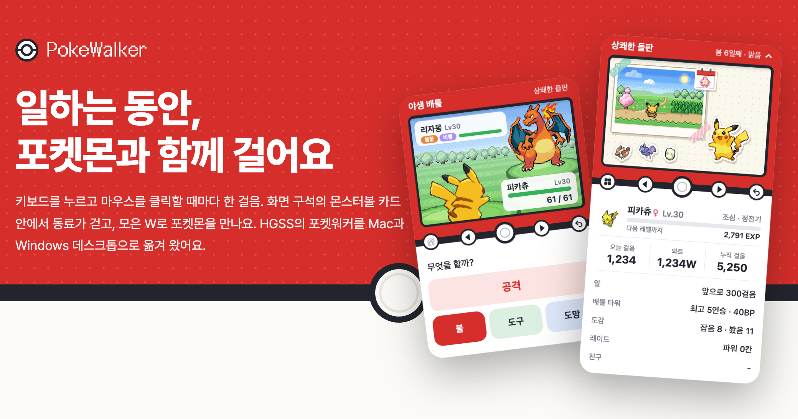

# PokeWalker — 포켓워커 데스크톱

키보드를 누르고 마우스를 클릭할 때마다 한 걸음. HGSS(2009)의 포켓워커를 Mac과 Windows 데스크톱으로 옮긴 앱이에요.
화면 구석의 몬스터볼 카드 안에서 동료가 걷고, 모은 W로 포켓몬을 만나고, 친구와 교환·레이드·대전까지 해요.



**목차**
- [받기 · 설치](#받기--설치) — [Mac](#mac) · [Windows](#windows) · [트레이너 ID · 세이브](#트레이너-id--세이브) · [자동 업데이트](#자동-업데이트)
- [게임 안내](#게임-안내) — [카드와 조작](#카드와-조작) · [걸음 · W · 시간](#걸음--w--시간) · [홈 · 메뉴](#홈--메뉴) · [포켓 레이더](#포켓-레이더--연쇄) · [배틀](#배틀) · [배틀 타워](#배틀-타워) · [레이드](#레이드) · [실시간 대전](#실시간-대전) · [친구](#친구) · [교환 게시판](#교환-게시판) · [우편함](#우편함) · [맡겨 키우기](#맡겨-키우기) · [포켓몬 · 도감 · 코스](#포켓몬--도감--코스) · [레벨 · 진화 · 알 · 날씨](#레벨--진화--알--날씨) · [도구 · 상점](#도구--상점--bp-교환소)
- [개발](#개발) — [빌드](#빌드) · [테스트](#테스트) · [release](#release-흐름) · [폴더 구조](#폴더-구조) · [그림 · 데이터 출처](#그림--데이터-출처)
- [서버](#서버)

---

## 받기 · 설치

팀 배포 페이지 **https://pokewalker.rulrulmo.work** (팀 비밀번호)에서 최신 Mac · Windows zip과 패치 내역을 받아요. 한 번 설치하면 그다음부터는 앱이 스스로 업데이트해요.

### Mac

macOS 13 이상, Apple Silicon · Intel.

1. zip을 풀고 `PokeWalker.app`을 **응용 프로그램 폴더**로 옮겨요. 다운로드 폴더에서 바로 실행하면 자동 업데이트가 안 돼요(메뉴에 이유가 보여요).
2. 처음 한 번은 **우클릭 → 열기 → 열기**. Apple 개발자 서명이 없어서 더블클릭하면 "확인되지 않은 개발자"로 막혀요.
   - macOS 15 이상에서 그래도 막히면: 한 번 실행해 본 뒤 **시스템 설정 → 개인정보 보호 및 보안 → 그래도 열기**.
   - 또는 터미널: `xattr -dr com.apple.quarantine /Applications/PokeWalker.app`
3. 알림 허용을 물으면 허용해요.

- 상단 메뉴 막대에 몬스터볼 아이콘과 W가 보여요(알이 곧 부화하면 `·알`). **클릭 = 카드 숨기기/보이기**, 우클릭 = 메뉴.
- 메뉴 막대 아이콘이 가려져 안 보이면 앱을 다시 열면(Finder · Spotlight) 카드가 다시 나와요.
- 이미 켜져 있을 때 다시 실행하면 켜져 있는 앱이 앞으로 나오고 새로 뜨지 않아요(같은 데이터 폴더 기준).
- 알림: Apple 인증서가 없는 앱이라 macOS가 알림 권한을 거절하면 `osascript`로 띄워요. 알림 센터에는 "스크립트 편집기" 이름으로 보여요.

### Windows

Windows 10 · 11, x64. 설치 프로그램 · 관리자 권한이 필요 없어요.

1. zip을 풀면 `PokeWalker` 폴더 하나(`PokeWalker.exe` + Swift 런타임 DLL + `Resources/`)가 나와요. **쓰기 권한이 있는 곳**(내 문서 등)에 폴더째 두세요. Program Files에서는 자동 업데이트가 안 돼요.
2. 처음 실행할 때 서명이 없어서 **SmartScreen**이 막으면 **추가 정보 → 실행**. (zip 속성에서 "차단 해제"를 체크해도 돼요.)

Mac과 다른 점:

| | Windows |
|---|---|
| 아이콘 | 메뉴 막대 대신 **알림 영역(트레이)** — 클릭 = 보이기/숨기기, 우클릭 = 메뉴, 마우스를 올리면 오늘 걸음 · W |
| 걸음 | **앱이 켜져 있는 동안만** 셈(Mac처럼 꺼 둔 동안의 입력을 읽을 수 없어요). 로그인할 때 켜 두려면 `Win+R` → `shell:startup`에 바로 가기 |
| 다시 실행 | 이미 켜져 있으면 숨긴 카드가 다시 나와요 |
| 글꼴 | 맑은 고딕(줄 길이는 Mac과 거의 같고 글자 모양만 달라요) |
| 데이터 | `%APPDATA%\PokeWalker\` — 세이브 캐시 · `cloud.json` · 설정 `settings.json` |

### 트레이너 ID · 세이브

- **세이브는 서버에** 있어요. 처음 켜면 **트레이너 ID**(2~12자, 한글 · 영문 · 숫자 · `_`, 대소문자 구분 없음)와 **PIN**(숫자 4자리)을 물어요. 없는 ID면 새 트레이너로 시작할지 물어요.
- 같은 ID와 PIN이면 Mac에서도 Windows에서도 이어서 해요. 다른 PC가 같은 ID로 들어오면 먼저 쓰던 PC는 멈추고 **●: 여기서 계속**으로 되찾아요.
- 앱은 한 일(걸음, 레이더, 배틀 명령, 상점, 도구 …)만 서버에 보내고, **결과는 서버가 정해요**(같은 게임 코드와 서버의 난수). 걸음은 15초마다 또는 다음 행동과 함께 올라가요.
- 인터넷이 끊기면 걸음만 쌓이고(앱을 꺼도 남아요) 나머지는 "연결되면 할 수 있어요". 메뉴의 서버가 필요한 칸도 흐려져요.
- 우클릭 메뉴: 트레이너 ID · 마지막 저장, **지금 저장**, **ID 바꾸기…**

### 자동 업데이트

- 켜고 30초 뒤, 그다음 6시간마다(서버가 "더 새 앱이 필요해요"라고 하면 바로) 확인해서 **조용히 받아 두고**, 다음에 끄거나 켤 때 바꿔 넣어요.
- 바로 바꾸려면 우클릭 → **업데이트 확인 · 설치** 또는 **업데이트 설치 (다시 시작)**. 배틀 · 대전 · 연출 중에는 끝난 뒤에 돼요.
- 릴리스 키(Ed25519)로 서명된 manifest와 zip의 SHA-256이 맞을 때만 설치해요. 실패하면 원래 앱으로 돌아가고 그 버전은 다시 시도하지 않아요.
- 자동으로 바꿀 수 없는 곳(다운로드 폴더에서 바로 실행, 쓸 수 없는 폴더)에서는 메뉴에 **이유와 방법**이 흐리게 보여요(예: "앱을 응용 프로그램 폴더로 옮겨 주세요"). 새 버전이 나오면 한 번 알려 줘요.

---

## 게임 안내

### 카드와 조작

창 하나가 몬스터볼 카드예요. 빨간 윗면에 **제목 줄**과 **LCD**(96×64 도트), 가운데 검은 띠에 버튼, 흰 아랫면에 **패널**이 있어요. LCD는 보는 화면, **누르는 곳은 아래 패널**이에요(DS처럼).

| 띠의 버튼 | 키보드 | 하는 일 |
|---|---|---|
| 메뉴/홈 | `M` | 홈에서 누르면 메뉴, 그 밖에선 홈으로(배틀 · 연출 중엔 꺼짐) |
| ◀ ▶ | `←` `→` | 고르기(메뉴 타일, 목록, 격자) |
| ● | `return` · `space` | 정하기. 홈에서는 동료 쓰다듬기(♥) |
| ↩ | `esc` | 한 단계 뒤로. 대답이 필요한 화면에선 커서만 '나가는 쪽'으로 |

- 격자는 `↑` `↓` 한 줄, `PageUp` `PageDown`과 휠로 한 쪽. 탭은 `Tab` / `shift-Tab`.
- 홈에서 제목 줄 **⌄**(또는 `Tab`)로 상태 시트를 접어요. **숨기기/보이기 단축키**: Mac `⌃⌥P` · Windows `Ctrl+Alt+P`.
- 패널은 한 번 클릭 = 실행이에요. 목록에서 포켓몬 · 기술을 고르는 곳은 **처음 누르면 보기, 한 번 더 누르면 정하기**예요.
- 우클릭 메뉴(옵션만):

| 메뉴 | 고를 수 있는 것 |
|---|---|
| 크기 | 보통 · 크게 · 아주 크게 (×1 · ×1.5 · ×2, 화면에 안 들어가는 크기는 꺼짐) |
| 기기 | 몬스터볼 · 슈퍼볼 · 하이퍼볼 · 마스터볼 · 프리미어볼(도감 15종) · 럭셔리볼(도감 50종) · 배틀 골드(40BP) |
| 화면 | 컬러 · 원작(흑백) · 백라이트 |
| 수첩 배경 | 점 격자 수첩 · 모눈 노트 · 줄 노트 · 크라프트지 · 코르크 보드 · 체크 무늬 천 |
| 화면 글씨 | 매끈하게 · 도트 |
| 배틀 속도 | 보통 ×1 · 빠르게 ×1.5(기본) · 아주 빠르게 ×2 |
| 알림 | 동료(주워 온 것 · 친구 · 교환 · 맡기기 · 대전) · 알 부화 · 진화 · 레벨 · 날씨 · 해금 · 업데이트, 그리고 테스트 알림 |
| 서버 · 업데이트 | 트레이너 ID, 지금 저장, ID 바꾸기…, 업데이트 줄, 종료 |

### 걸음 · W · 시간

- **키 1번 = 1걸음, 마우스 좌/우 클릭 1번 = 5걸음**. 무엇을 눌렀는지는 보지 않고 횟수만 세요. 손쉬운 사용 · 입력 모니터링 권한이 필요 없어요.
- **20걸음 = 1W** (최대 9,999W). 하루 최대 10만 걸음. 자정에 오늘 걸음이 기록으로 넘어가요(최근 7일).
- Mac은 같은 로그인이면 **앱을 꺼 둔 동안의 입력**도 다음 실행 때 더해요(1시간에 3,000걸음까지).
- **게임 속 시간 = 걸음**: 하루 = 1,000걸음(0걸음 = 아침 6시) — 새벽 4~6시 · 낮 · 저녁 17~20시 · 밤. **계절** = 7일(7,000걸음)마다 봄 → 여름 → 가을 → 겨울.

<details><summary>걸음 필터 (매크로 막기)</summary>

- 키보드 · 마우스 **장치에서 온 입력만** 세요. 다른 프로그램이 만든 입력은 버려요(Mac은 HID 카운터, Windows는 장치 핸들이 없는 SendInput 입력을 버림). Windows에서 길게 눌러 반복되는 키는 1번.
- 초당 15걸음 · 분당 600걸음까지.
- 2분 동안 거의 매초 일정한 속도로 들어오면 기계로 보고, 1분 쉴 때까지 멈춰요. 홈 제목 줄에 "자동 입력 감지 · 걸음 멈춤".
- 서버도 따로 셉니다: 초당 15걸음씩 차는 몫과 하루 10만 걸음.
- 세이브 캐시는 서명(HMAC)해 두고, 서명이 안 맞으면 마지막 저장으로 돌아가요.

</details>

### 홈 · 메뉴

**홈 = 스티커 여행 수첩.** 코스 그림이 마스킹테이프로 붙은 폴라로이드가 되고, 그 사진 속 길을 동료가 걸어요(빨리 칠수록 빠르게). 오른쪽엔 동료가 큰 스티커로, 왼쪽 아래엔 워커의 포켓몬(최대 3)과 알, 사진 모서리엔 계절 달력, 동료 위쪽엔 **맡아 키우는 친구의 포켓몬**(최대 2)이 있어요. 종이 색은 시간대를 따라요.

- 아래 **상태 시트**: 동료(Lv · EXP · 성격 · 특성 · V), 오늘 걸음 · W · 누적, 알 · 배틀 타워 · 도감 · 레이드 · 친구.
- **동료 이벤트**: 150~400걸음마다 말풍선(♪ ♥ !), 4번에 1번은 코스에서 도구를 주워 오고, 알이 없을 땐 8번에 1번 **알**을 주워 와요.
- 워커 스티커를 누르면 그 포켓몬과 함께 걸어요.

**메뉴**는 두 단계예요(3.9). 첫 화면 8칸 중 ▸가 붙은 칸은 누르면 그 안의 기능이 나오고, ↩로 첫 화면에 돌아가요(다시 열면 마지막에 고른 칸).

| | |
|---|---|
| 포켓 레이더 (10W) | 코스 |
| 포켓몬 | 기록 ▸ 도감 · 트레이너 카드 |
| 배틀 ▸ 배틀 타워 · 레이드 · 대전 | 친구 ▸ 친구 · 교환 |
| 상점 ▸ 상점 (W) · BP 교환소 | 우편함 |

- 빨간 점은 볼 게 있다는 뜻이에요(우편함: 새 우편 · 받을 선물, 교환: 새 제안, 친구: 받은 신청). 안에 점이 있으면 바깥 칸에도 떠요.
- 그룹 칸에는 안의 기능과 요약 한 줄(예: 배틀 "최고 n연승 · 파워 n칸")이 보여요.

### 포켓 레이더 · 연쇄

10W를 내면 LCD에 동료와 레이더 파동이 나오고, 1.5초 뒤 무언가 나타나면 **패널의 풀숲 4개** 중 흔들리는 곳(`!`)을 시간 안에 눌러요. 맞히면 배틀.

- **연쇄**: 잡거나 쓰러뜨리면 확률로 레이더가 이어져요(무료, 85%에서 연쇄마다 8%p씩 내려가 최저 35%). 이어질 때마다 **+2×연쇄 W**, **5연쇄마다** 그 코스의 가장 희귀한 도구. 놓치거나 도망 · 패배하면 끊겨요.
- 연쇄가 길수록: 희귀한 칸이 잘 나오고, **이로치** 확률이 올라가고(1/64 → 10연쇄 1/10), 야생 레벨이 2씩 오르고(최대 +20), **3·5·7·9연쇄에서 1·2·3·4V** 확정.

<details><summary>출현 규칙 자세히</summary>

- 코스마다 그룹 A · B · C 각 4마리(원작 2마리 + 서식지 · 포획률로 고른 2마리). 희귀한 A부터 걸음 조건을 채운 후보의 평균 확률로 그룹을 정하고, 그룹 안에선 무작위(날씨 타입 ×1.5). C는 보장.
- 연쇄 1마다 A · B 그룹 확률이 그룹 평균의 +20%(8연쇄까지).
- **서식지 손님**: 레이더 발견의 10%, 코스마다 5종.
- `!` 시간: 2.0초에서 연쇄마다 0.25초씩 줄어 최소 0.8초.
- 볼은 무료. 던질 때마다 몬스터볼 70% · 슈퍼볼 22% · 하이퍼볼 7.5% · 마스터볼 0.5%, 연쇄 1마다 몬스터볼 −3%p가 좋은 볼로(10연쇄 40 · 38 · 20 · 2).
- 동료가 코스의 특기 타입이면 필요 걸음 25% 감소. 부적금화 · 행운의향로를 지니면 연쇄 W 2배.

</details>

### 배틀

HGSS 싱글 배틀 규칙 그대로예요(더블 · 폼만 빼고). 능력치는 종족값 · **개체값**(0~31) · **노력치**(한 능력 255, 합 510) · **성격** 4세대 공식, 기술 467개 · 특성 123개 대부분, 상태이상 · 날씨 · 지닌 도구까지.

| 배틀 | 메뉴 | 경험치 |
|---|---|---|
| 야생 | 공격 · 볼 · 도구 · 교체 · 도망 | 나간 포켓몬은 한 몫, 나가지 않은 워커 포켓몬도 절반(3.9) |
| 배틀 타워 | 공격 · 도구 · 교체 · 기권 | 없음(BP만) |
| 레이드 | 공격 · 도구 · 교체 · 후퇴 | 쓰러뜨린 줄마다 |
| 실시간 대전 | 공격 · 교체 · 기권 | 없음 |

- **도구**는 나가 있는 포켓몬뿐 아니라 뒤에 있는 포켓몬에게도(회복 · 상태 · PP), 기절한 포켓몬에겐 기력의조각(50%) · 부활초(100%)로. **자동 부활은 없어요** — 마지막 포켓몬이 쓰러지면 져요.
- HP · PP · 상태이상은 배틀마다 새로(워커엔 포켓몬센터가 없어요). 배틀 중엔 기술 버튼 아래에 고른 기술의 분류 · 명중 · **설명**이 보여요.
- 야생 경험치는 5세대 레벨 차 보정 × 0.5 — 상대보다 높을수록 덜 받아요. 잡아도 같은 경험치 · 노력치.
- 3.9: 상대와 마주친 포켓몬은 한 몫과 노력치, 나가지 않은 포켓몬(동료 · 워커)도 **절반**(노력치 없음), 학습장치를 지니면 한 몫과 노력치. 배틀 끝엔 "다른 포켓몬도 경험치를 받았다!" 한 줄로 묶어 보여요.
- 지닌 도구: 쓰고 없어지는 도구(열매 · 허브 · 기합의띠 …)는 **야생 · 레이드** 배틀 뒤 없어져요. 트릭 · 도둑질로 바뀐 도구는 배틀이 끝나면 돌아와요.

### 배틀 타워

참가비 **50W**, 우리 3마리 vs 트레이너 3마리, **모두 Lv.50**으로 맞춰 싸워요(로비에 `Lv.70→50`).

- **파티**: 추천은 동료 + 경험치가 많은 2마리. 로비의 파티 줄을 누르면 **포켓몬 메뉴와 같은 격자**(정렬: 번호순 · 레벨순 · V순 · 최근)에서 3마리를 순서대로 골라요. **추천으로**를 누르면 원래대로.
- **BP**: 이길 때마다 `1 + (연승−1)÷7`(1~7연승 1, 8~14연승 2 …), 7연승마다 +3. 지거나 기권하면 연승이 끝나요(최고 기록은 남아요). 경험치 · 노력치는 없어요.
- 배틀 사이에 앱을 다시 켜도 연승이 이어져요(배틀 도중이면 그 배틀은 끝나요).
- **연승 보상**(3.9): 처음 닿을 때 한 번, **우편함**으로 와요(이미 넘은 연승도). 로비 아래 칸에 받은 연승은 체크, 다음 연승은 빨간 테두리.

| 연승 | 보상 |
|---|---|
| 7 · 14 · 21 · 28 · 35 | 이상한사탕 ×3 · 지닌 도구 1개 고르기 · 은색병뚜껑 · 금색병뚜껑 · 150BP |
| 50 · 70 | 트레이너 카드 **은장식**(+ 금색병뚜껑) · **금장식** |
| 100 | 칭호 **타워 타이쿤** + **이로치 전설** 1마리 고르기(35종, Lv.70 · 4V) |

- **타워 타이쿤**: 49번째(은) · 99번째(금) 배틀의 보스. 로비 버튼이 금색 "타워 타이쿤에게 도전"이 되고, LCD가 은 · 금 테두리로 바뀌어요. 이기면 BP 두 배.
- 장식 · 칭호는 내 트레이너 카드(LCD 테두리 · 메달), 친구 목록 · 친구 카드, 대전 상대 이름 옆에 보여요.

<details><summary>트레이너 단계</summary>

| 연승 | 상대 |
|---|---|
| 1~7 | 진화 단계 상관없이, 우리 파티와 비슷한 종족값 |
| 8~14 | 최종 진화형, 개체값 15~31 |
| 15~21 | + 노력치 252 · 252, 지닌 도구(자뭉열매 · 오랭열매 · 리샘열매 · 먹다남은음식) |
| 22~28 | 3V · 맞는 성격 · 좋은 기술 4개, 강한 지닌 도구(구애 도구 · 생명의구슬 · 기합의띠 …) |
| 29~35 | 5V |
| 36~ | 6V, 종족값 450 이상 |

트레이너는 센 기술 위주로 쓰고, 단계가 낮을 땐 가끔 무작위 기술을 써요.

</details>

### 레이드

팀 모두가 함께 **이번 주 보스**(Lv.70, 4V — 루기아 · 가이오가 · 그란돈 · 레쿠쟈 · 디아루가 · 펄기아 · 기라티나가 주마다 돌아가요)의 **팀 HP**를 깎아요.

- **파워**: 걸음이 쌓여 **10,000걸음 = 1칸**(최대 3칸). 한 번 싸울 때 1칸.
- **출전**: 1~3마리를 골라요(제 레벨 그대로, 지난번 고른 포켓몬이 먼저 골라져 있어요). 보스의 줄 3개와 싸우고, **턴 제한은 없어요** — 우리가 모두 쓰러지거나, 줄 3개를 다 쓰러뜨리거나, **후퇴**(언제나 바로 돼요)하면 끝. 준 데미지는 그대로 들어가요.
- 쓰러뜨린 줄마다 경험치와 **1BP**. 로비에 **기여 순위**와 **최근 공격**.
- 팀이 보스를 쓰러뜨리면 그 주에 싸운 사람은 **볼**(3개, 데미지를 많이 주면 +1 · +1)을 던질 수 있어요(30%, 이미 가진 종이면 15%). 첫 볼에 **클리어 보상**: 25BP · 이상한사탕 ×5 · 은색병뚜껑.

### 실시간 대전

메뉴 → **대전**. 탭은 **대전 · 전적**(최근 20판).

1. **대전 파티**: 동료 · 워커 · 상자에서 3~6마리를 순서대로 등록해요(대전에선 모두 Lv.50).
2. **상대 찾기**: 지금 걷는 **친구에게 신청**(1분 안에 수락) 또는 **랜덤 매칭**(1분 동안 기다리는 사람과 짝, 친구가 아니어도 돼요).
3. **3마리 고르기**: 서로의 대전 파티를 보고(상대는 종류만) 1분 안에 나갈 3마리를 순서대로 골라요. 시간이 지나면 앞의 3마리.
4. **배틀**: 한 번 고를 때마다 30초, 두 번 연속 시간을 넘기면 기권. 이기면 **+3BP**.

3.8 이상 앱끼리만 대전해요.

### 친구

메뉴 → **친구**. 탭: **친구**(지금 걷는 친구가 위) · **걸음**(이번 주, 월요일 시작) · **도감** · **타워** · **신청** · **맡기기**.

- **친구 신청**: 신청 탭의 **ID로 친구 신청**. 받은 신청은 수락 · 거절, 보낸 신청은 거두기.
- **친구 카드**: 워커의 포켓몬, 도감 · 타워 · 레이더 · 걸음 기록, 그리고 **대전 신청 · 맡기기 · 친구 끊기** 버튼(지금 걷는 중일 때만 대전 · 맡기기).
- 순위 탭은 10등까지와 나.

### 교환 게시판

메뉴 → 친구 ▸ **교환**. 탭: **전체 · 내 글 · 내 제안**.

- **글 올리기**: 상자의 포켓몬 하나와 원하는 종(본 적 있는 종에서 3개까지, 없으면 아무거나), **한마디**(20자까지). 한 사람이 3개까지, **3일** 동안.
- **제안**: 다른 사람의 글에 내 상자 포켓몬 하나로(동시에 5개까지). 글쓴이가 제안 하나를 고르면 교환돼요.
- 올리거나 제안한 포켓몬은 그동안 **상자에서 빠져 있어요**. 글을 내리거나 제안을 거두면 바로 돌아와요.
- 교환으로 받은 포켓몬과 돌아온 포켓몬(다른 제안이 골라졌을 때 · 글이 끝났을 때)은 **우편함**으로 와요(3.9, 예전의 받기 탭). 교환으로 받은 포켓몬은 받을 때 **지닌 도구로 통신 진화**해요.
- 지닌 도구도 함께 가요(올리기 · 제안 전에 한 번 알려 줘요). 새 제안이 생기면 메뉴의 **교환**에 빨간 점.

### 우편함

메뉴 → **우편함**(3.9). 연승 보상, 교환으로 받은 · 돌아온 포켓몬, 맡겨 키우기에서 돌아온 포켓몬, 운영자의 선물 · 공지가 와요.

- 목록은 받을 선물이 있는 우편이 먼저, 그다음 최근 순(한 쪽 6통). 우편을 열면 내용 · 선물이 보이고 **받기**. 고르기가 없는 우편은 **모두 받기**로 한꺼번에.
- **고르기**: 14연승 지닌 도구(7가지 중 1개), 100연승 이로치 전설(35종 중 1마리, 이미 가진 종도 똑같이). 한 번 누르면 LCD에 설명, 한 번 더 누르면 "받을까요?".
- 선물이 든 우편은 받을 때까지 남아요. 받은 우편 · 읽은 공지는 30일, 읽지 않은 공지는 90일 뒤 정리돼요.
- 새 우편이 오면 우편함 칸에 빨간 점과 알림(우클릭 → 알림 → 우편). 3.8 이하 앱에서는 받을 수 없어요.

### 맡겨 키우기

지금 걷는 친구의 카드에서 **맡기기** → 워커 · 상자의 포켓몬 하나를 **5시간** 동안 맡겨요(동료는 안 돼요).

- 친구 한 명에게 **1마리씩**, 여러 친구에게 동시에. 맡는 쪽은 **2마리까지**.
- 맡은 친구가 걷는 걸음만큼(1걸음 = 1) **경험치**가 쌓이고, 끝나면 **우편함**으로 돌아와요(받을 때 경험치가 들어가요). 맡은 쪽은 키운 **2,000걸음마다 1BP**(한 마리에 최대 5BP).
- 친구 → **맡기기** 탭에서 보낸 · 맡은 포켓몬을 보고, 언제든 **데려오기 / 돌려보내기**(그때까지의 걸음으로 정산). 맡은 포켓몬은 내 홈에서 동료 위쪽에 함께 있어요.

### 포켓몬 · 도감 · 코스

- **포켓몬**: 맨 위 줄에 **동료와 워커의 3칸**, 끝에 **도구 칸**, 그 아래 상자의 아이콘 격자(6×5, ★ 이로치, ◆ 3V 이상, 보석 = 지닌 도구). 정렬 탭 번호순 · 레벨순 · V순 · 최근.
  - 칸을 누르면 그 포켓몬의 페이지: **성격**(민트 효과), **특성**, **개체값 · 노력치 육각형**, 진화 방법, **도구**(누르면 **도구 주기** — 쓸 수 있는 도구와 지니게 할 도구), 기술(누르면 **기술 바꾸기**).
  - 버튼: 워커의 포켓몬 **함께 걷기 / 상자로 보내기**, 상자의 포켓몬 **함께 걷기 / 워커로 / 놓아주기**(레벨÷2 W). 놓아줄까?에서 **중복 놓아주기**(이로치 · 3V 이상은 남겨요).
  - 칸을 끌어서 워커 칸에 놓아도 돼요.
- **도감**: 493종 아이콘 격자(잡음 컬러 · 봤음 실루엣). 탭 전체 · 잡음 · 못 잡음 · 이 코스. 상세 페이지에 종족값 · 만나는 곳 · 진화.
- **코스** 35개: 기본 20개(누적 W로 열림), 이벤트 코스 7개(도감 10 · 20 · 30 · 45 · 60 · 80 · 100종), **전설 코스** 8개(도감 150~350종 — 레이더에서 2%(+연쇄당 1%, 최대 6%)로 아직 없는 전설). 코스를 바꿔도 워커 팀 · 도구는 그대로.
- **트레이너 카드**: 코스 · 걸음 · 일수 · 도감, 최근 7일 그래프, 알.
- 도감 보상: 이벤트 · 전설 코스, 기기 색(프리미어볼 15종 · 럭셔리볼 50종).

### 레벨 · 진화 · 알 · 날씨

- **1걸음 = 경험치 1**(동료, 원작 규칙). 워커의 포켓몬은 **2걸음 = 1**. 경험치는 포켓몬마다 따로 저장돼요.
- **진화**는 4세대 방식: 레벨 · 친밀도(함께 10,000걸음) · 시간대 · 장소 · 진화의 돌(어떤 포켓몬에게든, 도구 창이나 도구 주기에서) · 통신교환(교환 게시판에서 지닌 도구로). **레벨이 오를 때만** 진화하고, 변함없는돌을 지니면 진화하지 않아요. 진화는 되돌릴 수 없어요.
- **새 기술**: 4개 미만이면 바로 배우고, 4개면 잊을 기술을 골라요(처음 누르면 설명, 한 번 더 누르면 결정). 넘긴 기술은 **기술 바꾸기**에서 언제든.
- **알**: 코스에 안 나오는 계열의 기본형 111종(아직 없는 종 먼저). 원작 부화 걸음만큼 걸으면 Lv.1로 상자에.
- **날씨**: 1,000걸음마다 맑음 · 비 · 눈 · 안개(코스 종류와 계절이 기울여요). 날씨에 맞는 타입이 잘 나와요(맑음 불꽃 · 풀 / 비 물 · 전기 / 눈 얼음 / 안개 고스트 · 에스퍼).

### 도구 · 상점 · BP 교환소

**도구 창**(포켓몬 → 도구 칸)은 탭 **회복 · 배틀 · 육성 · 민트 · 지닌 도구 · 열매 · 진화 · 기타**(가진 것만)로 나뉘어요. 워커의 3칸이 먼저 쓰이고 그다음 가방. 육성 도구는 **쓸 포켓몬 고르기**에서 동료 · 워커 · 상자 누구에게나(효과 없으면 흐리게, 이유와 함께).

| 도구 | 효과 |
|---|---|
| 영양제(맥스업 · 타우린 · 사포닌 · 리보플라빈 · 키토산 · 알칼로이드) | 그 능력 노력치 +10, **한 능력 255까지 · 합 510까지** |
| 노력치 열매(유석 · 시마 · 파비 · 로매 · 또뽀 · 토망) | 그 능력 노력치 **−10** |
| 순백떡 | 노력치 전부 0 |
| 이상한사탕 | 레벨 +1 |
| 은색병뚜껑 · 금색병뚜껑 | **대단한 특훈**(Lv.50부터): 하나 · 전부를 31로(배틀에서만) |
| 민트 21종 | 능력치가 그 성격을 따라요(원래 성격은 그대로 보임) |
| 그 밖의 열매 | 함께 걸은 걸음 +500(친밀도) — 오랭 · 자뭉 · 상태 열매는 배틀용 |
| 진화의 돌 · 진화 도구 | 맞는 포켓몬이 진화 |
| 지닌 도구 | 포켓몬 페이지 → 도구 주기 · 지니게 하기(바꾸면 원래 것은 가방으로) |
| 금구슬 · 진주 · 기술머신 … | 팔기(10~100W), 도구 창 위의 **팔 것 모두 팔기** |

**상점**(W) 탭: 회복 · 배틀 · 육성 · 민트 · 지닌 도구 · 열매 · 진화 · 전설. **BP 교환소** 탭: 회복 · 육성 · 지닌 도구 · 기기 색 · 전설. 한 번에 99개까지, 전설은 하나씩 "정말 살까?".

<details><summary>상점 · BP 교환소 목록과 가격</summary>

**상점 (W)**

| 탭 | 도구 · 가격 |
|---|---|
| 회복 | 상처약 20 · 좋은상처약 60 · 고급상처약 150 · 풀회복약 300 · 회복약 400 · 기력의조각 200 · 해독제 10 · 마비치료제 20 · 잠깨는약 25 · 화상치료제 25 · 얼음상태치료제 25 · 만병통치제 60 · PP에이드 120 |
| 배틀 | 플러스파워 50 · 디펜드업 55 · 스페셜업 35 · 스페셜가드 35 · 스피드업 35 · 잘-맞히기 95 · 크리티컬커터 65 · 이펙트가드 70 |
| 육성 | 영양제 6종 각 100 · 노력치 열매 6종 각 20 · 순백떡 200 |
| 민트 | 21종 각 1,000 |
| 지닌 도구 | 타입 강화 도구 · 향로 500, 플레이트 16종 1,000, 학습장치 · 부적금화 · 행운의향로 2,000, 행복의알 3,000, 변함없는돌 200 … (43종) |
| 열매 | 상태 · 회복 열매 50~150, 반감 열매 200, 핀치 열매 300~500 (44종) |
| 진화 | 지금 동료의 진화 도구 각 1,000 |
| 전설 | **칠색조 Lv.50 — 9,999W**(3V, 여러 번 살 수 있어요) |

**BP 교환소**

| 탭 | 도구 · BP |
|---|---|
| 회복 | 고급상처약 3 · 풀회복약 5 · 회복약 6 · 부활초 6 · PP에이더 4 · PP맥스 8 |
| 육성 | 이상한사탕 8 · 영양제 6종 각 1 · 은색병뚜껑 25 · 금색병뚜껑 120 |
| 지닌 도구 | 구애 도구 · 생명의구슬 · 기합의띠 · 먹다남은음식 · 금강옥 · 백옥 · 백금옥 … 32, 선제공격손톱 · 초점렌즈 · 왕의징표석 … 24, 허브 · 날씨 바위 · 파워 도구 … 16, 연막탄 8 (60종) |
| 기기 색 | 배틀 골드 40 (한 번만) |
| 전설 | **뮤츠 Lv.70 — 300BP**(3V, 여러 번 살 수 있어요) |

칠색조 · 뮤츠는 코스 · 레이드 · 타워에 나오지 않고 여기서만 얻어요.

</details>

---

## 개발

Swift 6, 외부 의존성 없음. Mac은 `swiftc`로 AppKit 앱을, Windows는 SwiftPM(`Package.swift`)으로 Win32 앱을 만들어요. 게임 규칙 · 배틀 엔진(`Sources/Model`, `Sources/Battle`)은 서버와 같은 코드예요.

### 빌드

```sh
./build.sh            # 빌드 + 셀프테스트(실패하면 빌드 실패) + PokeWalker.app 조립
./build.sh run        # 빌드 후 실행 — 이름이 PokeWalker인 프로세스를 모두 끄니, 설치된 앱도 꺼져요
./build.sh dist       # dist/PokeWalker.zip — Apple Silicon + Intel 유니버설, macOS 13+, 애드혹 서명
./build.sh publish    # release (아래), --dry: 올리기 전까지만
```

- 저장소 안에서 실행한 빌드(`build.sh` 옆)는 데이터를 **`PokeWalker Dev`** 폴더에 따로 두고, 자동 업데이트를 하지 않아요. 설치된 앱과 같이 켜져도 돼요(설정 `defaults dev.khmin.pokewalker`는 같이 써요).
- Windows: `PokeWalker.exe --selftest > st.txt`, `PokeWalker.exe --render <폴더>`(대표 화면 PNG).

### 테스트

| | |
|---|---|
| `--selftest` | 빌드마다 도는 셀프테스트(약 560개). 규칙 · 배틀(데미지 공식은 Bulbapedia 예시로) · 데이터 · 무작위 배틀 + 가짜 서버(`FakeCloud`)로 화면을 버튼 · 클릭 · 키로 조작하는 흐름 |
| `--shots <폴더>` | Mac 화면 렌더 PNG(약 150장) — 바뀐 화면은 직접 보고 확인 |
| `--live-test` · `--live-team` · `--live-trade` · `--live-raid` · `--live-social` · `--live-duel` · `--live-hold` · `--live-v38` | 실서버 테스트(zz + 6자리 테스트 ID, 개발 빌드만) |
| Windows CI | `.github/workflows/windows.yml` — 빌드 · 셀프테스트 · 렌더 61장 · 실행 확인(`gh workflow run windows.yml --ref main`) |

| 파일 | 내용 |
|---|---|
| `Tests/SelfTest.swift` | 셀프테스트 본체 |
| `Tests/Online.swift` | 가짜 서버로 하는 흐름: 교환 · 레이드 · 친구 · 게시판 · 대전 · 맡기기 · 도구 … |
| `Tests/LiveTest.swift` | `--live-*` |
| `Tests/Shots.swift` | `--shots` |
| `Tests/UpdateFixtures.swift` | 자동 업데이트(서명된 9.9 manifest 등) |

### release 흐름

1. 버전(`Info.plist` · `Platform.swift`의 `windowsVersion`)과 `docs/patch-notes.txt`를 고치고 main에 push.
2. Windows CI가 그 커밋에서 통과.
3. `./build.sh publish` — Mac zip + 그 커밋의 Windows 빌드 zip + 서명한 manifest를 GitHub release `v<버전>`에, 패치 노트는 `patch-notes.txt`의 그 버전 칸.
4. 엔진(`Sources/Model` · `Battle` · `Data`)이나 서버가 바뀐 릴리스면 서버를 먼저 설치(`server/build.sh install`).
5. 서버 쪽에서 `server/publish.sh` — 서명 · 크기 · SHA-256을 확인한 뒤에야 배포 페이지와 `/v1/update`가 새 버전을 알려요.

릴리스 키는 `tools/release-key.swift`(비밀 키는 릴리스 Mac의 `~/.config/pokewalker/`에만).

### 폴더 구조

| 경로 | 내용 |
|---|---|
| `Sources/Model/` | 규칙과 세이브(Foundation만, 서버와 같이 씀): `Walk` 걸음 · W · 세이브 / `Engine` · `EngineRules` 행동과 결과 / `Mint` 서버가 만드는 포켓몬 / `Shop` 도구 · 상점 · 타워 / `Held` 지닌 도구 / `Items` 도구 / `Mon` 포켓몬 / `Course` 코스 · 진화 / `Team` 친구 · 교환 · 레이드 · 대전 응답 / `StepGate` 걸음 필터 / `Sign` · `Ed25519` 서명 / `Store` 데이터 폴더 |
| `Sources/Battle/` | 4세대 싱글 배틀 엔진: `Types` · `Battle` · `Turn` · `Damage` · `Effects` · `EndOfTurn` · `Holding`(지닌 도구) · `Duel`(대전의 상대 쪽 보기) |
| `Sources/Core/` | 플랫폼과 무관한 앱 몸통(Mac · Windows가 같이 씀): `Walker` · `Flow` · `Act`(서버로 보내는 행동) · `Cloud`(서버 연결, 가짜 서버) · `Update` · `Compose`(LCD) · `Page` · `Pane`(패널) · `Notebook`(홈 수첩) · `BattleView` · `TeamView` · `MarketView` · `RaidView` · `DuelScreen` · `SquadView`(파티 고르기) · `VisitView` · `ItemView` · `Menu` … |
| `Sources/Mac/` | AppKit 껍데기: `WalkerView` · `SideView` · `MacCanvas` · `MenuBar` · `MacHost` |
| `Sources/Windows/` | Win32 껍데기(Windows에서만 컴파일): `WinApp` · `WinCard`(창 · 트레이 · Raw Input 걸음) · `WinInput` · `SoftCanvas` · `WinFonts` · `WinRender` |
| `Sources/App/main.swift` | 실행: 앱, `--selftest` · `--shots` · `--live-*` 등 |
| `Sources/Data/` | **생성됨**: `Data.swift` · `BattleData.swift`(`tools/gen.py`), `MoveText.swift` 기술 설명(`tools/gen-movetext.py`) |
| `Resources/` | **생성됨**: 스프라이트 · 아이콘 · 애니메이션 · 걷기 도트 `.bin`, 글꼴 Galmuri(SIL OFL) |
| `server/` | 세이브 서버(아래) |
| `docs/` | `patch-notes.txt` 패치 내역, `plans/` 설계 문서, `images/` README 그림 |
| `tools/` | `gen.py` · `gen-movetext.py` 데이터 생성, `release-key.swift`, `hero/` README 대표 이미지 |

Mac 데이터 폴더 `~/Library/Application Support/PokeWalker/`: `state.json`(+ `.sig`, `.bak`) 서버 세이브의 캐시 · `cloud.json` ID · 세션 · 아직 안 올린 걸음 · `update/` 받아 둔 업데이트.

### 그림 · 데이터 출처

`tools/gen.py`가 받아서 `tools/.cache`에 캐시하고, 결과만 커밋해요(Pillow 필요).

| 무엇 | 어디서 | 결과 |
|---|---|---|
| HGSS 배틀 스프라이트(앞 · 뒤, 일반 · 이로치) | PokeAPI sprites `generation-iv/heartgold-soulsilver` | `hgss.bin` |
| 4세대 박스 아이콘 | PokeAPI sprites `generation-iv/icons` | `icons.bin` |
| HGSS 등장 애니메이션 | PokeAPI sprites `heartgold-soulsilver/animated` | `anims.bin` |
| HGSS 알 · 배틀 타워 트레이너 | PokeAPI sprites · Pokémon Showdown trainers | `frames.bin` |
| HGSS 필드 걷기 도트 | [teobz/pkmn-hgss-animated-overworld-sprites](https://github.com/teobz/pkmn-hgss-animated-overworld-sprites) | `walk.bin` |
| 코스(포켓몬 · 도구 · 확률) | Serebii — HGSS 포켓워커 코스 | `Data.swift` |
| 이름 · 타입 · 기술 · 특성 · 성격 · 진화 · 종족값 | PokeAPI CSV | `Data.swift` · `BattleData.swift` |
| 기술 설명(한국어) | PokeAPI move_flavor_text (X · Y 우선) | `MoveText.swift` |
| 글꼴 Galmuri9 · Galmuri7 | npm `galmuri`, SIL OFL | `Resources/fonts/` |

---

## 서버

세이브 서버는 `server/`(Swift, Hummingbird + SQLite)예요. 집 미니 PC에서 돌고 Cloudflare Tunnel로 **https://pokewalker.rulrulmo.work** 에 열려 있어요. 자세한 건 [server/README.md](server/README.md).

- **서버가 게임을 정해요**: 앱은 행동만 `POST /v2/act`로 보내고, 서버가 같은 게임 코드(`EngineRules`)와 서버의 난수로 결과를 정해 세이브를 만들어요. 포켓몬은 모두 서버가 만들어 기록하고, 걸음은 서버도 따로 세요.
- **API**: 로그인 · 만들기 · PIN · 업데이트 확인 · 다운로드는 `/v1`, 게임은 `/v2` — `act` · `team`(친구 · 맡기기) · `trades` · `box` · `raid` · `market`(교환 게시판) · `mail`(우편함, 3.9) · `duel`(실시간 대전, 롱 폴링).
- **배포 페이지**: 팀 비밀번호로 최신 Mac · Windows zip, 패치 내역, 화면 렌더.
- **자동 업데이트**: `/v1/update`가 최신 버전의 서명된 manifest를, `/v1/download/<mac|windows>`가 zip을 줘요.

---

코스 한국어 이름은 번역(공식 한국판 명칭 아님). 스프라이트 · 데이터 저작권은 Nintendo / Game Freak / The Pokémon Company — 개인 소장용, 저장소는 비공개로.
